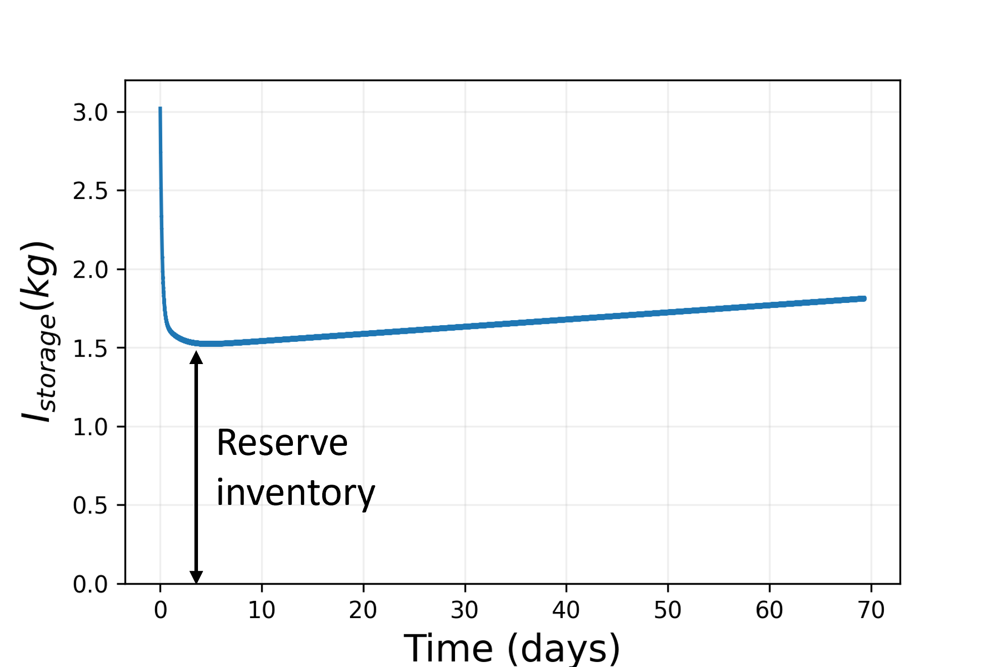

<script type="text/javascript" src="http://cdn.mathjax.org/mathjax/latest/MathJax.js?config=TeX-AMS-MML_HTMLorMML"></script>
<script type="text/x-mathjax-config">
  MathJax.Hub.Config({ tex2jax: {inlineMath: [['$', '$']]}, messageStyle: "none" });
</script>

## Disclaimer
The present pdf was created from the notebook described [here](https://github.com/SamueleMeschini/reserve-inventory/blob/main/reserve_inventory_dist.md). To get the jupyter notebook email me (sam_mesc@mit.edu or samuele.meschini@polito.it). The notebook has been developed for didactical purposes, hope you don't mind the very informal narrative style! 

## Reserve inventory in fusion reactors: do we really need it?

The tritium inventory in a fusion reactor has a strong impact on tritium self-sufficiency and reactor safety. Furthermore, tritium is extremely costly (30 M$/kg). 
One of the major goals of tritium fuel cycle modeling and design is to minimize the total tritium inventory in the reactor (when we speak about _reactor_, we mean the tokamak itself and all the systems that deal with tritium, such as the _tritium plant_ or the _tritium carrier loop_). 

### 1. Start-up inventory
We need tritium to start reactor operations. The initial amount of tritium required to start a fusion reactor is called start-up inventory, and it is stored in the _storage system_. Unluckily, the start-up inventory cannot be computed _a priori_ because it depends on the tritium breeding timescale, which is a non-trivial function of the blanket and extraction system dynamics. Let's suppose that we know that timescale, and let's call the time at which the tritium bred becomes available for fueling **inflection time** ( $t_{infl}$) (Figure 1). 
Since our reactor is designed to have $TBR > 1$, the tritium bred is larger than the tritium burnt, and once we cross the inflection time, our tritium inventory starts rocketing!

*Figure 1 - Storage inventory evolution showing the inflection time*


Why is the storage inventory decreasing for $t < t_{infl}$?

For $t < t_{infl}$, a fraction of the tritium bred is lost due to permeation and diffusion in solid materials. Furthermore, the tritium bred at $t = 0$ needs time to reach the extraction system, to be extracted and to be sent to the storage system. This is the physical explanation of the inflection time, and that's why we need a start-up inventory even if $TBR > 1$!

A very rough estimation of the start-up inventory can be made by considering the tritium burnt up to $t_{infl}$ : $I_{startup} = \dot{T} t_{infl}$, where $\dot{T}$ is the tritium burn rate. However, we are still missing the term accounting for the tritium lost due to permeation and diffusion (if we want to be precise, we can include also the tritium lost due to radioactive decay). A more precise estimation of the star-up inventory would be 
$I_{startup} = \dot{T} t_{infl} + T_{losses}$, where $T_{losses}$ accounts for all the possible lossess from $t = 0$ to $t = t_{infl}$. Note that if computed in this way, $I_{startup}$ is minimized (i.e., at the inflection point the amount of tritium in the storage inventory is 0). But what happens if something goes wrong?

### 2. Reserve inventory
Since we are good engineers, we add a certain level of conservativism in our analysis. Let's suppose that a pipeline in the fuel cycle fails at $t < t_{infl}$, and a fraction of the tritium processed gets lost (e.g., $25$% of the nominal stream). We need to provide this $25$% of tritium stream in some way, otherwise the reactor has to be shut down because the tritium for fueling is not enough. That's when the reserve inventory comes into play. We use this additional (stored) tritium to fuel the reactor until the failure is repaired [Abdou et al., 2021](https://iopscience.iop.org/article/10.1088/1741-4326/abbf35/meta?casa_token=tvhh_GtixQcAAAAA:-H4tANoAZA0r067kHn9ugiuMKWswGLdKWBnebeK2e44WK2TN3EUBSXNG-Gsj9XZhYMxKFwEBIw). Practucally speaking, we are adding an arbitrary large term to the storage inventory $I_{startup} = \dot{T} t_{infl} + T_{losses} + I_{reserve}$. 


*Figure 2 - Storage inventory evolution including a reserve inventory at start-up*


In this way the reactor can keep operating and we don't incur in economic losses. Very smart, isn't it? Actually, no. Have you ever heard about overconservativism?

### 3. A risk informed approach
If you have read the draft on the fuel cycle analysis of ARC, you probably know that larger start-up inventories require higher $TBR$, and complicates tritium safety in the reactor. In a certain sense, including a reserve inventory goes against the principle of minimizing the start-up inventory. This may not be a dramatic issue for reactors with low fusion power (e.g., for an ARC-class reactor the reserve inventory may add 1.5-2kg, accounting for 50% of the start-up inventory), but it becomes crucial for high fusion power reactors. For a $3\ GW_{th}$ reactor (e.g., DEMO or STEP), the reserve inventory may be tens of kilogram, which is clearly unacceptable (_reminder_: the World tritium supply peak will be located somewhere between 30 and 60 kg in 2030-2040 [Kovari et al., 2017](https://iopscience.iop.org/article/10.1088/1741-4326/aa9d25/meta?casa_token=hQgeNumRhsEAAAAA:yEroHF1cNrtg5f-EXqCrXBBO5rfrXIYz-t10EgPJKH_rQAv6xxQHgrling9oo0vrLhYig6W_Zw)).
The main point here is to understand if a reserve inventory is needed by quantifying the risk of not having it. Risk informed approaches are gaining importance in the safety field, thanks to their capability to provide a clear view on the risk (thus consequences) of certain events or actions. The goal of this notebook is to explain how we can assess this risk and the benefits of such an approach.


*Figure 3 - Storage inventory with and without reserve inventory, for different reactor desings (ARC and STEP)*


 #### 3.1 Find a suitable metric for the risk assessment
The presence of a reserve inventory impacts tritium self-sufficiency (higher required TBR), while its absence has no relevant drawbacks apart from the economic losses due to the reactor shutdown. It seems therefore natural to use the economic losses as a measure of the risk associated to the absence of a reserve inventory. If the reactor is shut down for a time equal to $t_{out}$, the economic losses ( $C_{losses}$) associated to this event are:


$$C_{losses} = P_{el}  c_{el} t_{out} + {\lambda_{decay}} I_{storage} c_T t_{out}$$


where $P_{el}$ is the reactor electric power, $c_{el}$ is the cost of electricity, $c_T$ is the tritium cost and ${\lambda_{decay}}$ is the tritium decay rate. The first term accounts for the unrealized gains from selling electricity during the downtime and the second term accounts for the tritium lost due to radioactive decay during the downtime. 

Since the failures occur randomly (according to their failure distribution) and last for a random time, a probablistic approach is needed. The risk will be quantified as the _probability that the economic losses overcome the cost of the reserve inventory_.

So, let's start with the code.


```python
import numpy as np
import matplotlib.pyplot as plt
import pandas as pd
from scipy.stats import lognorm
```

Here we define two classes: Reactor() simulates reactor operations including failures, while Processing() contains a series of useful functions to deal with the tritium inventories and characteristic timescales.


```python
class Reactor():
    def __init__(self, AF, 
                sigma, 
                loc,
                mean,
                failure_rate,
                N_sim,
                N_samples,
                storage_inventory,
                baseline_reserve_inventory,
                time,
                reserve_time=24*3600,
                reserve_inventory=0,
                lifetime = 30*8760*3600,
                independent_var = "outage",
                verbose=False):

        """Inits Reactor 
        
        Args:
            AF (float, scalar): Availability factor of the reactor. Used to compute the total downtime in a lifetime. (-)
            sigma (float, scalar): standard deviation of the lognormal distribution associated to the outage times. (-)
            loc (float, scalar): shift of the lognormal distribution associated to the outage times. (s)
            mean (float, scalar): mean of the lognormal distribution associated to the outage times. (s)
            failure_rate (float, scalar): global failure rate of the system used by the exponential distribution to sample failure times. (s-1)
            N_sim (int, scalar): number of simulations to be run
            N_samples (int, scalar): number of samples from the lognormal distribution and the exponential distribution. (-)
            storage_inventory(float, 1xN): the storage inventory from a fuel cycle simulation with a reserve inventory = 0, as a function of time. (kg)
            baseline_reserve_inventory (float, scalar): the reserve inventory that the reactor would have - but we are not considering. (kg)
            time (float, 1xN): sampled simulation times from a fuel cycle simulation. (s)
            reserve_time (float, scalar): reserve time set by design. Default is one day (24 * 3600s). (s)
            reserve_inventory(float, scalar): reserve inventory used in the fuel cycle simulation, if any. Default is 0. (kg)
            lifetime (float,scalar): total lifetime (or mission time) of the reactor. Default is 30y. (s)
            independent_var(string): "outage" or "fr". "outage" will compute the outage durations independently and the failure rate from the lifetime and the number of outages. 
                                     "fr" will sample the failure times and compute the lognormal distribution that gives the proper outage durations.
            verbose (Bool): print messages if True

            """

        self.lifetime = lifetime
        self.downtime = self.lifetime * (1 - AF)
        if independent_var == "outage":
            self.sigma = sigma # Variance of the lognormal distribution
            self.loc = loc # shift of the lognormal distribution
            self.mean = mean # mean of the lognormal distribution
        else:
            self.failure_rate = failure_rate
        self.verbose = verbose
        # Simulation parameters
        self.N_sim = N_sim
        self.N_samples = N_samples

        # Reactor quantities
        self.storage_inventory = storage_inventory
        self.reserve_inventory = reserve_inventory
        self.baseline_reserve_inventory = baseline_reserve_inventory
        self.reserve_time = reserve_time
        self.time = time

        # Processing tool
        self.processing = Processing(self.storage_inventory.copy(), self.time, self.baseline_reserve_inventory)

    def computeFailureRate(self):
        """Compute the average failure rate according to the number of outages sampled by the lognormal distribution"""
        self.number_of_failures = self.outage_matrix[0].shape[0]
        self.MTBF = self.lifetime / self.number_of_failures # take the first array of outages. For large samples, the MTBF computed in this way is a good approximation of the average one. 
        self.failure_rate = 1 / self.MTBF

    def sampleOutageTimes(self):
        """Sample outage times according to a lognormal distribution"""
        self.outage_times = lognorm.rvs(self.sigma,self.loc, scale=np.exp(self.mean), size=self.N_samples) # Sample the outage_times for the n-th simulation

    def outageTimes(self):  # Compute the outage array for N_sim
        """From a list of outage times, take only the first M times such that the sum is equal to the 
            total downtime, computed from the availability factor"""
        self.outage_matrix = [] # empty list to store the outage arrays

        for n in range(self.N_sim):
            self.outage_list = [] # Empty list to store the outage times
            self.T = 0 # Set back T to 0 at the beginning of the simulation
            self.sampleOutageTimes()
            for outage_time in self.outage_times:
                self.outage_list.append(outage_time) 
                self.T += outage_time 
                if self.T > self.downtime: # if the cumulative outage time is larger than the total downtime, we found the amount of failures for the specified AF
                    break
            if n % 10 == 0 and self.verbose:
                print("Simulation number : {}. Total number of failure is {}".format(n, len(self.outage_list)))
            self.outage_matrix.append(self.outage_list)

        self.outage_matrix = np.array([np.array(fs) for fs in self.outage_matrix], dtype='object') #convert the outage list to a numpy array

    def failureTimes(self):
        """Sample system failure times from an exponential distribution with the given failure rate"""
        self.beta = 1 / self.failure_rate # scale parameter, used to sample the RV
        self.failure_times = np.random.exponential(scale=self.beta, size=self.outage_times.shape) # s
 
    def orderFailureTimes(self):
        """Order (not sort) the failure times on the time axis. The first failure occurs at the first sampled failure time.
            The second failur occurs at t_first + outage_time_first + t_second, and so on for the subsequent failures"""
        self.start_failure_times = np.cumsum(self.failure_times)
        self.subsequent_failure_times = self.start_failure_times + np.delete(np.insert(self.outage_times, 0,0),-1)
       
    def run(self):
        """Run simulations up to the simulation time. Each simulation accounts for the downtimes due to system failure.
            The cost for each simulation is computed according to the time lost without electricity production and the cost of the decayed tritium."""
        self.cost = np.zeros(shape=(self.N_sim))
        self.processing.findSimulationTime()
        self.t_sim = self.processing.simulation_time
        self.outageTimes()
        for n in range(self.N_sim): 
            # if n % 100 == 0:
            #     print("Simulation {} done".format(n))
            self.processing.storage_inventory = self.storage_inventory.copy()
            if self.verbose:
                print("Simulation number {}".format(n))
            t = 0 
            idx = 0
            self.outage_times = self.outage_matrix[n] 
            self.computeFailureRate()
            self.failureTimes()
            self.orderFailureTimes()
            t = self.subsequent_failure_times[idx]
            while t < self.t_sim:
                if self.verbose:
                    print("Failure at {:.1f} days".format(t/3600/24))
                # if self.outage_times[idx] < self.reserve_time:
                self.processing.findReserveInventory(t)
                self.current_reserves = self.processing.reserve_inventory 
                if self.current_reserves <= (N_dot/f_b/eta_f*q* self.outage_times[idx]):                                          
                    self.cost[n] += (c_el *  P_el/1e3 * self.outage_times[idx]/3600 + c_T * decay_fraction * self.current_reserves * self.outage_times[idx])           
                else:
                    self.processing.storage_inventory -= (N_dot * self.outage_times[idx])       
                idx += 1
                t = self.subsequent_failure_times[idx]


class Processing():
    """A basic class with some processing tool to compute useful quantities for the simulations (inflection time, reserve inventory,...)
    """
    def __init__(
        self, 
        storage_inventory,
        time,
        baseline_reserve_invenotry
    ):
        """Inits Processing

        Args:
            storage_inventory(float, 1xN): the storage inventory from a fuel cycle simulation with a reserve inventory = 0, as a function of time. (kg)
            time (float, 1xN): sampled simulation times from a fuel cycle simulation. (s)
            baseline_reserve_inventory (float, scalar): the reserve inventory that the reactor would have - but we are not considering. (kg)
           
        """

        self.storage_inventory = storage_inventory
        self.baseline_reserve_inventory = baseline_reserve_invenotry
        self.time = time
        self.findInflectionTime() 
        

    # Find the inflection time given the storage inventory evolution
    def findInflectionTime(self):
        " Returns the inflection time and the index at which the inflection time occurs"
        self.inflection_time, self.index = self.time[np.argmin(self.storage_inventory)], np.argmin(self.storage_inventory)
        
    def findSimulationTime(self):
        " The simulation time is chosen as the time at which the storage inventory equals the baseline reserve inventory"
        self.simulation_time = self.time[self.storage_inventory - self.baseline_reserve_inventory > 0 ][0]
 
    def reserveTime(self):
        """Compute the Reserve time as a function of t from the storage inventory"""
        self.reserve_time = self.storage_inventory / N_dot / q * eta_f * f_b 
        self.findInflectionTime()
        self.reserve_time[:self.index] = 0

    # Find the value of the reserve time at t = failure time
    def findReserveTime(self, failure_time):
        """ reserve_time: I_res(t) as computed by reserve_time()
            time: the simulation time as extracted from Matlab simulation
            ft: failure time
        """
        if np.any(self.time - failure_time>0):
            self.reserve_time[self.time - failure_time > 0][0]
        else:
            self.reserve_time = np.inf


    def findReserveInventory(self, failure_time):
        """Find the reserve inventory given the storage inventory evolution.
            If the failure happen at t > t_inflection, then we can consider the storage inventory as the maximum reserve inventory
            
            Args:
                failure_time (float, scalar): a failure time previously sampled. (s)
        """
        if failure_time < self.inflection_time: # Check if the failure occurs before the inflection time -  if so, reactor will be shutdown because the startup inventory has been optimized to be 0 at the inflection point
            #print('Shutdown')
            self.reserve_inventory = -1
        else:
            self.reserve_inventory = self.storage_inventory[self.time - failure_time > 0][0] # return the storage inventory at the time of failure

```

## Baseline Scenario
We will simulate reactor operations under faulty conditions. Reactor failures are sampled from an exponential distribution with failure rate $\lambda$. Each failure lasts for a random outage time $t_{out}$, which is sampled from a lognormal distribution with mean $\mu$ and std $\sigma$. If you have ever tried to carry out safety analysis for fusion reactor, you probably know that both $\lambda$ and the lognormal distribution parameters are completely unknown. But we can make an educated guess that should be not far from the reality. Our jolly here is the reactor availability factor, $AF$.

At the present time we have no clue of what will be the availability of a fusion reactor. To be commercially viable, AF should be _at least_ $50$%. To convince yourself, try to compute the payback time of an ARC-class reactor, assuming a total cost of 5B$ (neglecting interests on debt, contingencies, spare components, etc...)


```python
P_el = 200e3 # kW, Electric power output
c_el = 0.18 # $/kWh, average electricity cost in Massachusetts
c_reactor = 5e9 # $, total reactor cost
AF = 0.5 # reactor availability
print("Payback time for an ARC-class reactor is: {:.2f} years".format(c_reactor/(P_el*c_el*AF)/8760))
```

    Payback time for an ARC-class reactor is: 31.71 years
    

Good, we bounded $AF$ between $50$% and $100$%. Let's initialize the parameters for the simulation.


```python
# General reactor data
N_dot = 8.99e-7 # kg/s, tritium burn rate
eta_f = 0.5 # fueling efficiency
f_b = 0.02 # burn fraction
q = 0.25 # fraction of the fuel cycle failing
AF = 0.5 # availability factor 
t_res = 3600 *24 # s, reserve time
I_res =  N_dot / eta_f / f_b * q * t_res # kg, reserve inventory
P_el = 200e6 # W, reactor power output
decay_fraction = 1.73e-9 # 1/s, tritium decay fraction

# Lognormal distribution parameters
s = 1 # std
loc = 3600*24 # shift
mu = 8.2 # mean
# Exponential distribution parameters
failure_rate = 1e-7 #1/s, failure rate

# Parameters for cost functions
c_T = 3e7 # $/kg, tritium cost
c_el = 0.18 #$/kWh, average electricity cost 
C_res = N_dot / eta_f / f_b * q * t_res * c_T # $, reserve inventory cost

# General simulation parameters
N_sim = 10000 # Total number of simulations.
N_samples = 3000 # Samples from the lognormal distribution


```

Furthermore, the outage times and the total number of failures are not free parameters, but are linked by the following relations:

$$T_{downtime}=\sum_{i=0}^{N_{failure}} t_{out,i} $$


$$N_{failures} =  {\lambda}T_{mission} $$


$$T_{downtime} = T_{mission} (1-AF) $$


where $T_{downtime}$ is the total downtime during the reactor lifetime and $T_{mission}$ is the reactor mission time (or lifetime).
Lastly, we have an additional relation between the average outage time ($\tilde{t}_{out}$) and the reserve time:


$$t_{res} \approx \tilde{t}_{out} $$


This should be a quite obvious relation: the reserve inventory must sustain the operations for a time comparable to the average outage time. Longer times introduces unnecessary large reserve inventories (for reasonable $AF$, two failures before the inflection times are extremely unlikely), shorter times may not allow to sustain the operations in case of failures, thus making the reserve inventory useless. The methods `Reactor.outageTimes()` and `Reactor.computeFailureRate()` solves the previous equations to find the outage times and the failure rate consistent with the input $AF$.

Below you can see a sampling of outage times from a lognormal distribution with an average outage time of approximately 24 hours (86400 s).


```python
# Sample outage times from a lognormal distribution
s = 1 # std
loc = 3600*24 
mu = 8.2 # mean
N_samples = 10000
outage_times = lognorm.rvs(s,loc,scale=np.exp(mu), size=N_samples) # TODO: capire come settare il minimo
counts, bins, ignored = plt.hist(outage_times, 100, density=True, align='mid')
x = np.linspace(min(bins), max(bins), 10000)
pdf = (np.exp(-(np.log(x) - mu)**2 / (2 * s**2))/ (x * s * np.sqrt(2 * np.pi))) 
plt.plot(x,lognorm.pdf(x,s, loc, scale=np.exp(mu)), 'r-.')
plt.xlabel('$t_{out} (s)$', fontsize=16)
plt.ylabel('pdf', fontsize=16)
plt.xlim(right=140000)
plt.title('Outage time sampling', fontsize=16)
plt.show()

```


    

    


## Running a simulation
The theoretical background and the motivations should be now clear. To run a simulation, we need to import the storage inventory from a fuel cycle simulation and create an instance of the reactor class.


```python
# Import the storage inventory. 
df = pd.read_csv(r'C:\Users\smesc\OneDrive - Politecnico di Torino\PhD\fuelcycle\storage_inventory.csv', header=None)
storage_inventory = df.iloc[:130000,0].to_numpy()
time = df.iloc[:130000,1].to_numpy()
plt.plot(time[:20000]/3600/24, storage_inventory[:20000])
plt.xlabel('Time (days)', fontsize=16)
plt.ylabel('$I_{storage} (kg)$', fontsize=16)
plt.grid(True, alpha=0.2)

```


    

    


In principle `Reactor.run()` runs $N_{sim}$ simulations to provide statistics on the results. Let's try to run just a simulation for the moment


```python
# Instantiate the reactor
N_sim = 1
failure_rate = 1e-8 # This is actually a dummy value because we are computing the failure rate from the AF
reactor = Reactor(AF, s, loc, mu, failure_rate, N_sim, N_samples, storage_inventory, I_res, time, t_res)
reactor.run()
```

    Simulation 0 done
    

We can assess the economic losses for each simulation with the following strategy:

- If the failure occurs at $t < t_{infl}$, the reactor is shut down and we compute the economic loss. As a matter of fact, the start-up inventory is minimized (i.e., the amount of tritium is barely sufficient to fuel the reactor until the inflection time is reached). Any additional demand of tritium would not allow to reach the inflection point, so we must shut down the reactor, fix the failure and start again the operations. Note that the tritium losses due to radioactive decay during the downtime are negligibles for downtimes of the order of days ( $T_{lost}\approx 0.2 g$)
- If the failure occurs at $t > t_{infl}$, we can use a fraction of the stored inventory to sustain the operations, provided that $I_{storage} > \frac{\dot{T}} {f_b\eta_f} q t_{out}$. If the amount of tritium in the storage inventory is not enough, the reactor is shut down and we incur in economic losses.

The economic losses are summed up at the end of the simulation, and their value can be compared to the cost of the reserve invenotry


```python
print("Economic losses due to failures are: {:.0f} M$".format(reactor.cost[0]/1e6))
print("Cost of the reserve inventory is: {:.0f} M$".format(C_res/1e6))
```

    Economic losses due to failures are: 85 M$
    Cost of the reserve inventory is: 58 M$
    

Starting the operations with a reserve inventory is more convinient for this particular case. 
Let's now try to be more consistent, running at least $10^4$ simulations for different availability factors.


```python
N_sim = 10000
AF = np.array([0.5, 0.6, 0.7, 0.8, 0.9, 0.99])
reactors = [Reactor(af, s, loc, mu, failure_rate, N_sim, N_samples, storage_inventory, I_res, time, t_res ) for af in AF]
for reactor in reactors:
    reactor.run()
```

We now plot the histogram of the reactor economic losses for each simulation and for each availability factor. We also build the cumulative probability and check what is the probability that the economic losses overcome the cost of the reserve inventory.


```python
for n in range(len(AF)):
    if n!=5: # just avoid to plot the last case AF = 0.99, it would be extremely out of scale
        counts, bin = np.histogram(reactors[n].cost,density=True, bins=100)
        total_counts = np.cumsum(counts)
        dx = bin[1] - bin[0]
        fig, ax = plt.subplots(ncols=1)
        ax1 = ax.twinx()
        ax.hist(reactors[n].cost,bin, density=True, alpha=0.5)   
        ax.set_xlabel('Economic losses ($)', fontsize=16)
        ax.set_ylabel('Probability', fontsize=16)
        ax1.plot(bin[:-1],total_counts*dx, 'r')
        ax1.set_ylabel('Cumulative probability', fontsize=16)
        ax1.axvline(C_res, ls='--', color='k')
        ax1.legend(['CDF', 'Reserve inventory cost'])
        ax.set_title('AF = {}'.format(AF[n]), fontsize=16)

        # compute the probability 
        if np.any(bin[:-1]-C_res>0):
            probability = total_counts[bin[:-1]-C_res>0][0] * dx *100 
        else:
            probability = 100
        print("For AF = {} the probability that the cost is lower without reserve inventory is {:.2f}".format(AF[n],probability))

```

    For AF = 0.5 the probability that the cost is lower without reserve inventory is 0.01
    For AF = 0.6 the probability that the cost is lower without reserve inventory is 0.01
    For AF = 0.7 the probability that the cost is lower without reserve inventory is 0.01
    For AF = 0.8 the probability that the cost is lower without reserve inventory is 2.11
    For AF = 0.9 the probability that the cost is lower without reserve inventory is 99.96
    


    

    


    

    


    

    


    

    


    

    


For $AF > 0.8$ the situation becomes interesting, because not having a reserve inventory may be more advantageous than having one. If $AF > 0.9$ it is definitelty worth to accept some economic losses due to reactor shutdown. 

You may have noticed that we considered just the cost of a reserve inventory for comparison. This is quite unfair, because a reactor with a reserve inventory may still incur in economic losses if multiple failures occur during the lifetime. It seems reasonable to compute a more precise cost for the reactor starting its operation with a reserve inventory. Practically speaking, this means running similar simulations with a start-up inventory that includes the reserve inventory. The probability of a reactor shutdown is _lower_ (but not null) in this case because we can rely on the reserve inventory.


```python
reactors_reserve = [Reactor(af, s, loc, mu, failure_rate, N_sim, N_samples, storage_inventory, I_res, time, t_res, reserve_inventory=1.5 ) for af in AF]
for reactor in reactors_reserve:
    reactor.run()
    reactor.cost += C_res
```


```python
for n in range(len(AF)):
    if n!=5: # just avoid to plot the last case AF = 0.99, it would be extremely out of scale
        counts, bin = np.histogram(reactors[n].cost,density=True, bins=100)
        counts_res, bin_res = np.histogram(reactors_reserve[n].cost, density=True, bins=100)
        total_counts = np.cumsum(counts)
        total_counts_res = np.cumsum(counts_res)
        dx = bin[1] - bin[0]
        dx_2 = bin_res[1] - bin_res[0]
        fig, ax = plt.subplots(ncols=1)
        ax.hist(reactors[n].cost,bin, density=True, alpha=0.5)   
        ax.hist(reactors_reserve[n].cost, bin_res, density=True, alpha=0.5)
        ax.set_xlabel('Economic losses ($)', fontsize=16)
        ax.set_ylabel('Probability', fontsize=16)
        ax.legend(['w/o reserve inventory', 'with reserve inventory'])
        ax.set_title('AF = {}'.format(AF[n]), fontsize=16)

```


    

    


    

    


    

    


    

    


    

    


In this more realistic case, the probability to incur in a certain economic loss is always higher for the case with reserve inventory (including the initial cost of $I_{res}$). 

To answer the initial question _Do we really need a reserve inventory?_, it seems that for this realistic (but not exhaustive) case, a reserve inventory results in an oversizing of the storage system and an unnecessary upfront cost. 

### Final considerations
There are some final considerations to be made, which will drive future analysis:

- For very large reserve inventories (i.e., reserve inventories that can withstand many failures before running out of tritium) the cost may be lower than the economic losses, especially if the cost of electricity rises. However, for high fusion powers, a very large reserve inventory may be unpractical due to scarcity of tritium supply

- A very naive calculation may show that the reserve inventory is always more expensive than facing shutdown: 


```python
print("Economic losses due to a single failure of 24 h: {:.2f} M$".format(P_el/1e3*c_el*(24)/1e6))
print("Cost of the reserve inventory to face a 24 h accident: {:.2f} M$".format(C_res/1e6))
```

    Economic losses due to a single failure of 24 h: 0.86 M$
    Cost of the reserve inventory to face a 24 h accident: 58.26 M$
    

- Basically, the cost of electricity is so low if compared to the cost of tritium that having additional tritium is much more expensive than shutting down the reactor. However, we are not considering possible additional costs related to the interruption of a service (as a energy utility, a fusion reactor will need to provide electricity at a constant rate, apart from scheduled maintenance) and costs related to the start-up phase.

- With reference to the previous point, an energy storage system may at least mitigate the consequences of a shutdown by providing electricity output while the reactor is off.

-  The absence of a reserve inventory lowers the start-up inventory, which in turn lowers the required TBR. We are not able to assess the economic advantages of lower required TBR, but they may be significative. 
